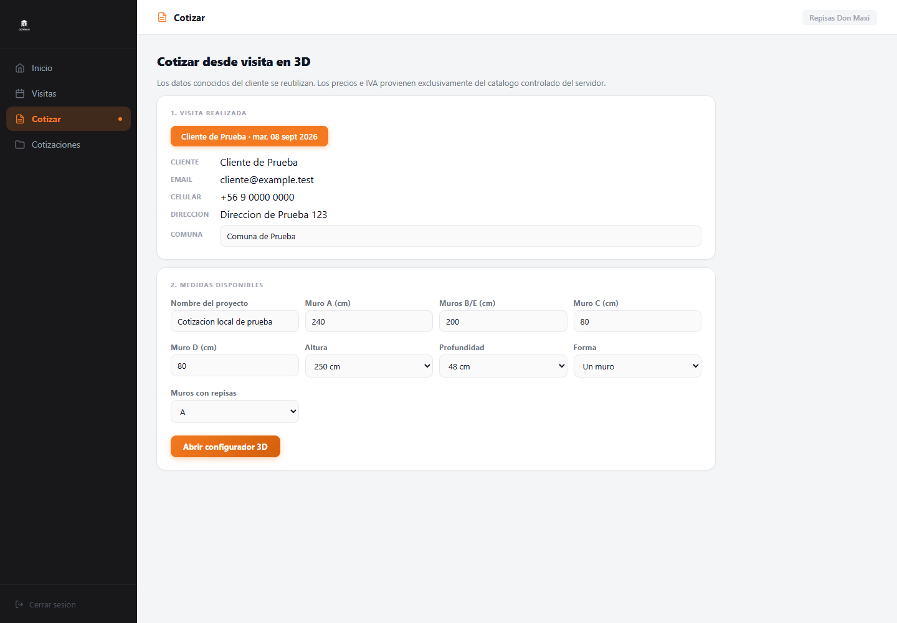
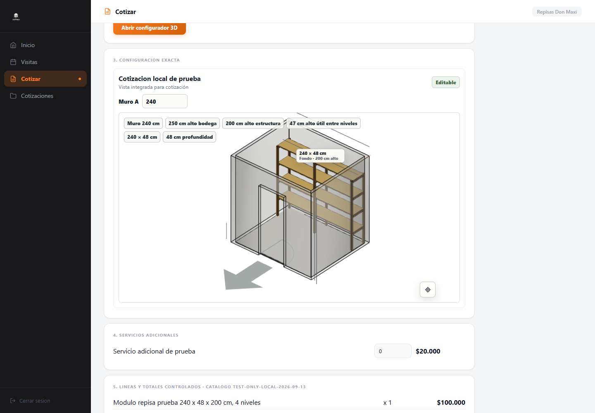
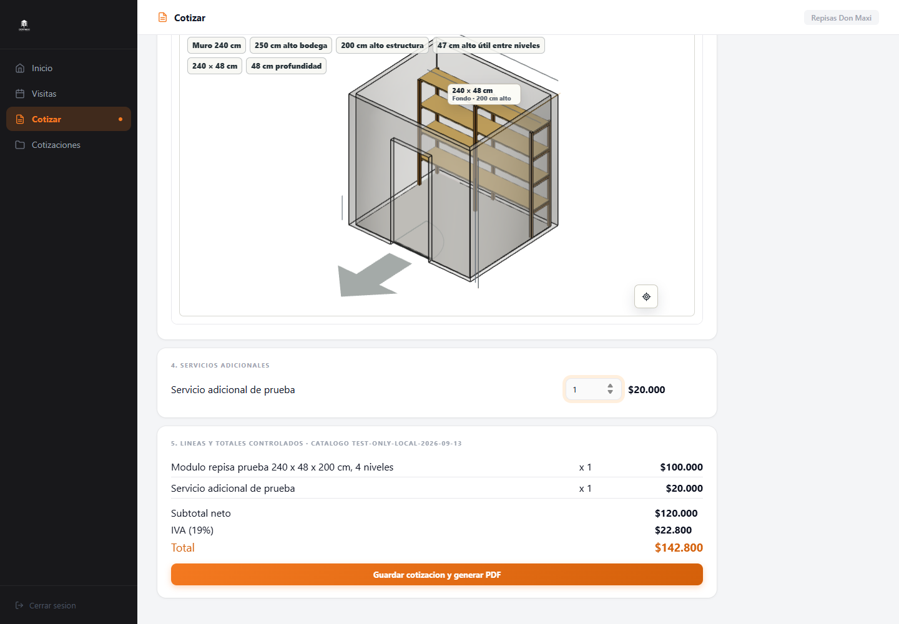
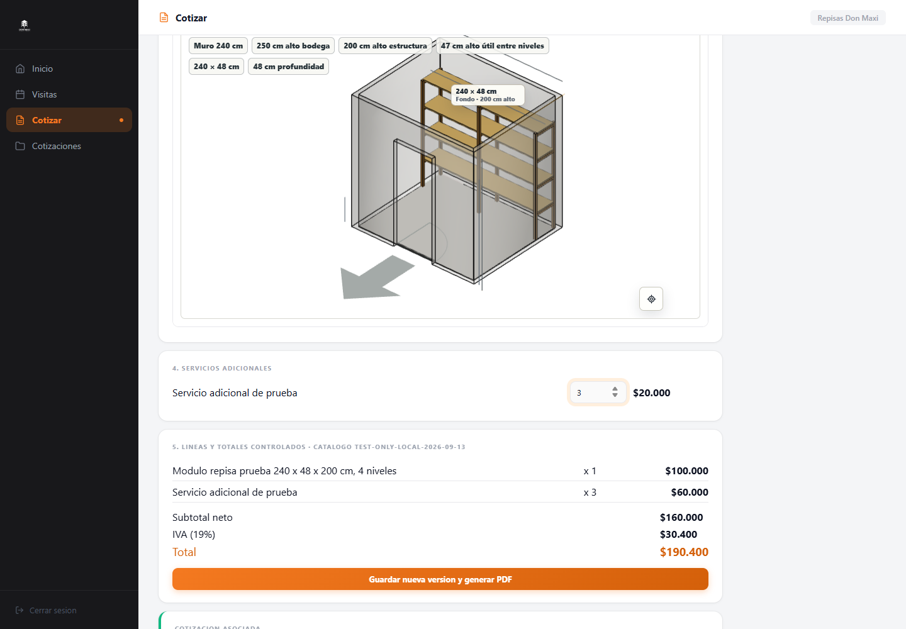
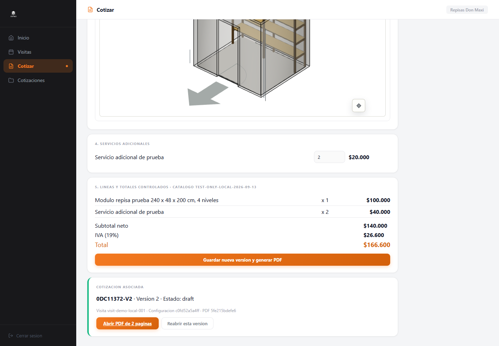
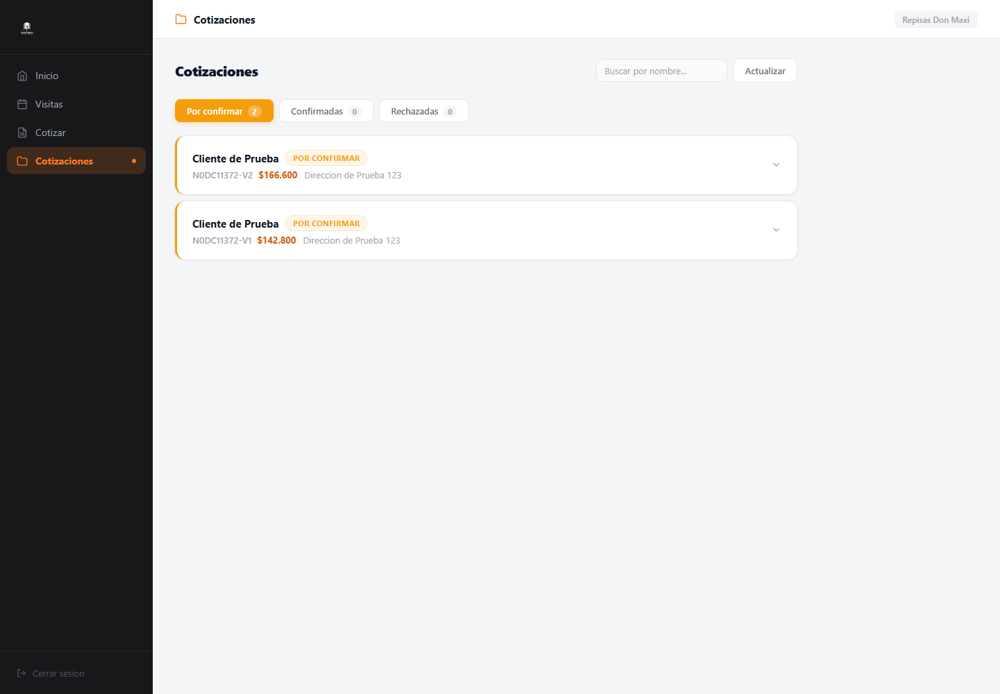
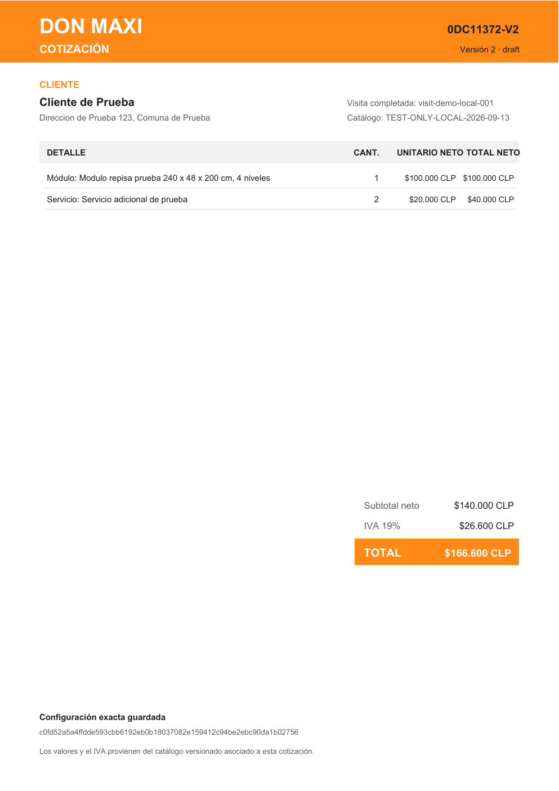
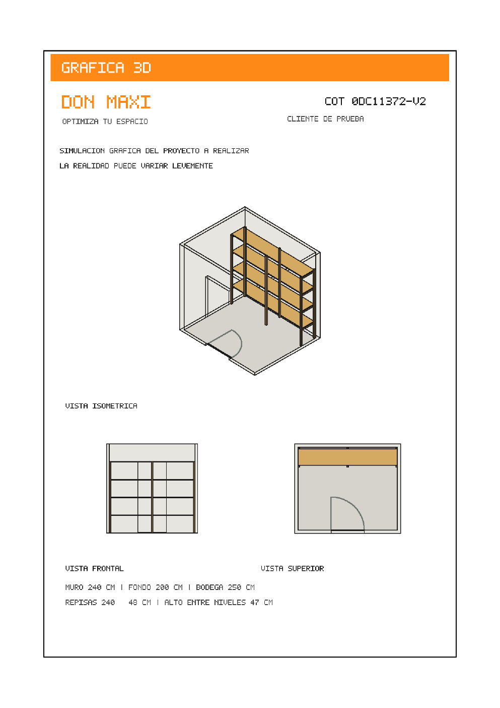

# Completed visit to 3D quotation: verification evidence

Verified locally on 2026-09-14 at `http://127.0.0.1:5176/admin?demo=1` using fictitious demo data and a controlled test-only catalog. No new functional, visual, or console issues were found in the completed workflow.

## Visit preload and embedded configurator

The completed visit is selected with its known customer fields and available measurements already populated. The same visit launches the embedded configurator without re-entering those values.

## Controlled quotation totals and saved versions

The first version contains one controlled module and one service. The second version preserves the module and changes the service quantity to two; the server-controlled subtotal, IVA, and total update reproducibly.

## Exact-version reopening

An unsaved service change was made after saving V2. Reopening V2 restored the saved quantity and totals, demonstrating that the exact stored configuration/version—not the transient form state—was loaded.

## Customer, visit, status, and version visibility

Both immutable versions remain visible under the same fictitious customer and visit with their current quotation status.

## Native two-page PDF

The saved V2 PDF was generated locally without ConvertAPI. Page 1 contains the customer, visit, controlled line items, totals, version, and saved-configuration hash. Page 2 contains useful views exported from that saved 3D configuration.

